# Projeto **Trivia** #

Foi desenvolvido em um projeto em grupo ao longo do curso da [Trybe](https://www.betrybe.com) um jogo de perguntas e respostas baseado no jogo **Trivia** _(tipo um show do milhão)_.

Link para o Projeto:

Os participantes do grupo são:  
[Luiz Fernando C. Módolo](https://github.com/LuizModolo).  
[Maria Laura](https://github.com/marialaura27).  
[Thomaz J. Lima](https://github.com/thomazjeffersonlima).  
[Vanessa M. Rios](https://github.com/vanessamrios).  
[Vivian Ost](https://github.com/vivianost)   

As tecnologias utilizadas com base em JavaScript foram _React e Redux_.

  - A API utilizada para a realização desse projeto foi a [Open Trivia Database](https://opentdb.com/api_config.php), que nos fornece perguntas e conteúdo em inglês. 
  - Para logar no jogo foi utilizado a API [Gravatar](https://pt.gravatar.com/), assim você ter sua foto associada ao perfil de usuário.
  - Acessar a página referente ao jogo, onde se deverá escolher uma das respostas disponíveis para cada uma das perguntas apresentadas.
  - Temos um timer de 30 segundos para resposta ser selecionada, se não cumprir é considerado errado.
  - Ser redirecionada, após 5 perguntas respondidas, para a tela de score, onde o texto mostrado depende do número de acertos.
  - Visualizar a página de ranking, se quiser, ao final de cada jogo.

### Caso queira acessar os códigos do Projeto: ###
1. Clone o repositório
  * `git clone git@github.com:LuizModolo/project-trivia.git`
  * Entre na pasta do repositório que você acabou de clonar:

2. Instale as dependências e inicialize o projeto
  * Instale as dependências:
    * `npm install`
  * Inicialize o projeto:
    * `npm start` (uma nova página deve abrir no seu navegador com um texto simples)

### Telas do projeto em funcionamento ###

### Desktop ###

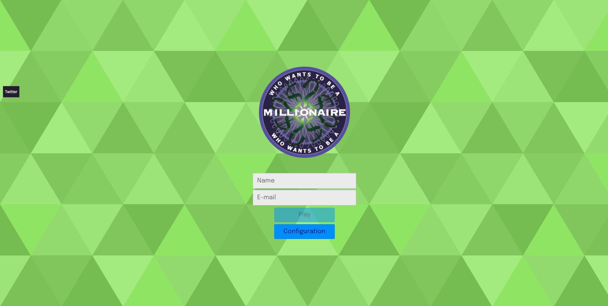 
Tela de Login.   

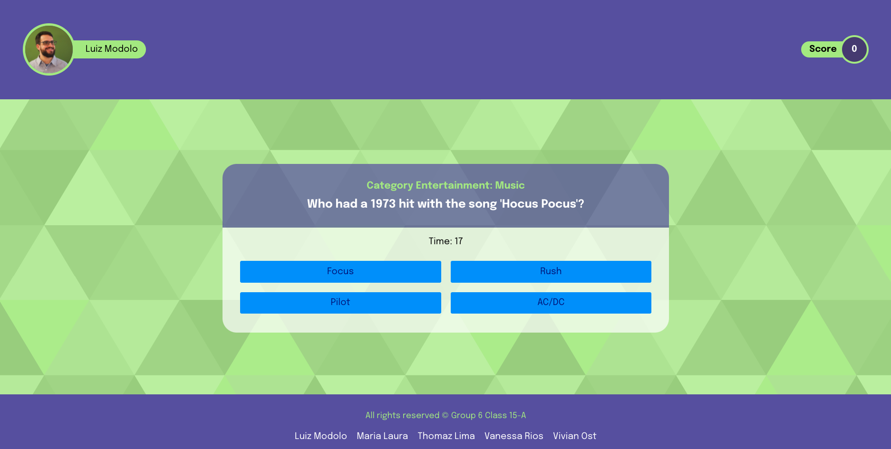 
Tela da pergunta múltipla escolha.    

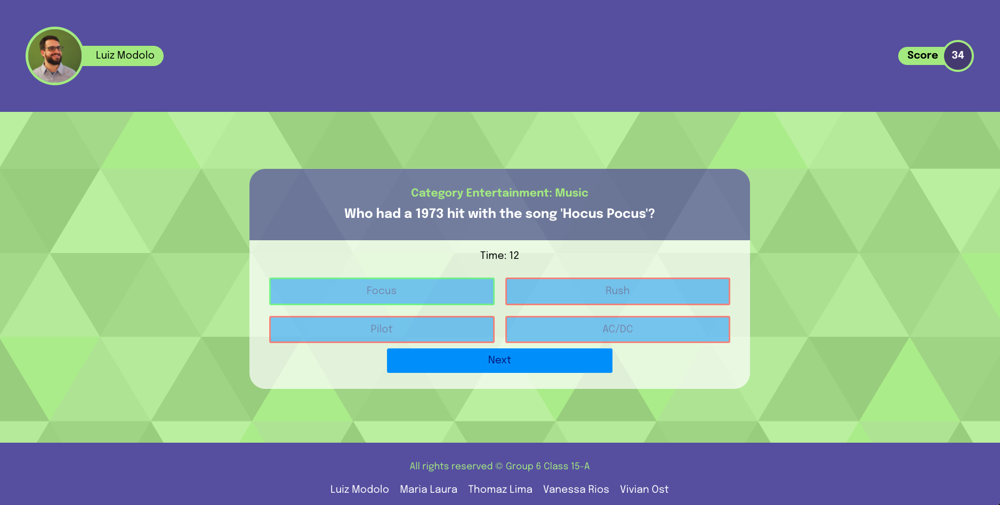 
Tela da pergunta múltipla escolha após clique.   

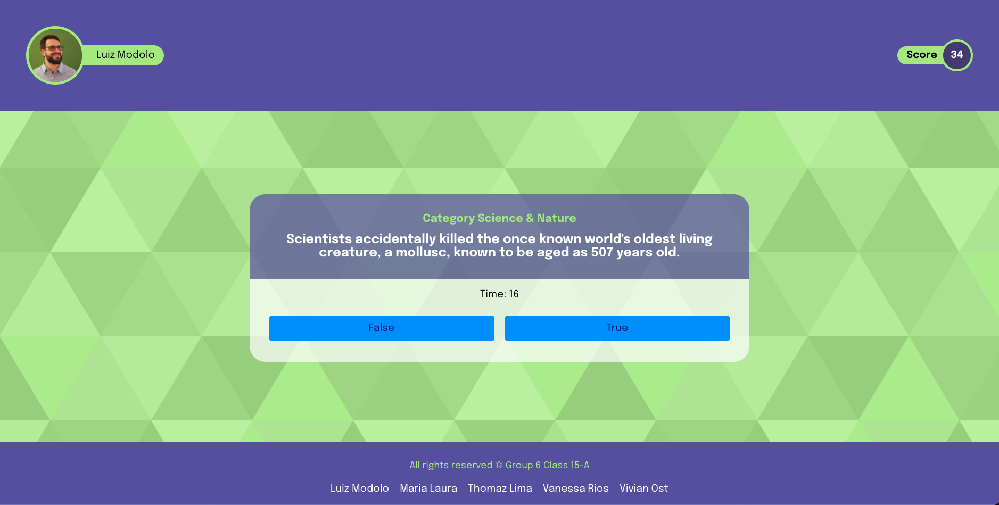 
Tela da pergunta verdadeiro ou falso.   

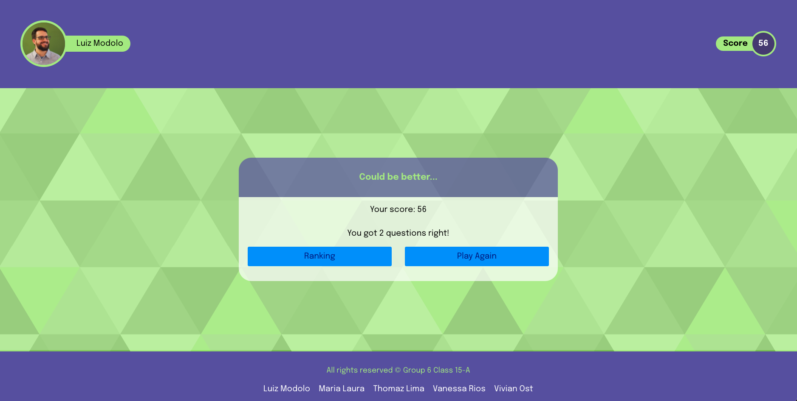 
Tela da de feedback negativo.   

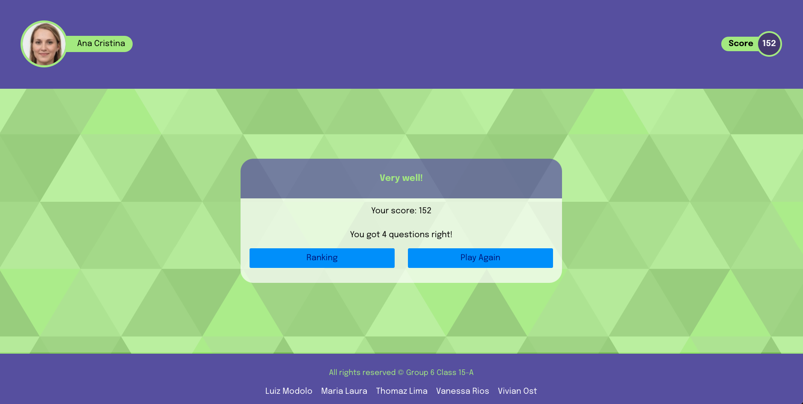 
Tela da de feedback positivo.   

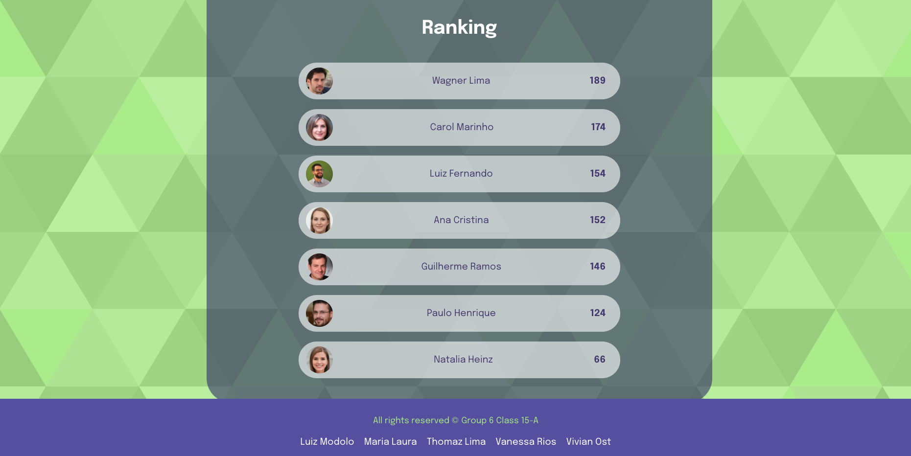 
Tela da de feedback ranking.   

### Mobile ###

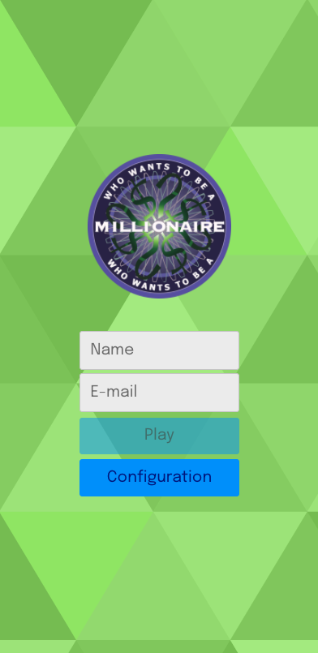 
Tela de Login.   

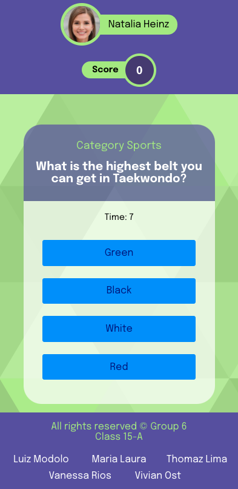 
Tela da pergunta múltipla escolha.    

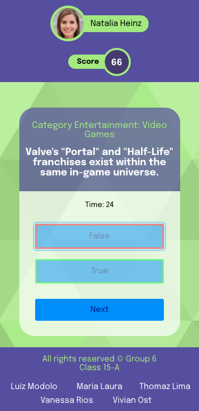 
Tela da pergunta verdadeiro ou falso após clique.   

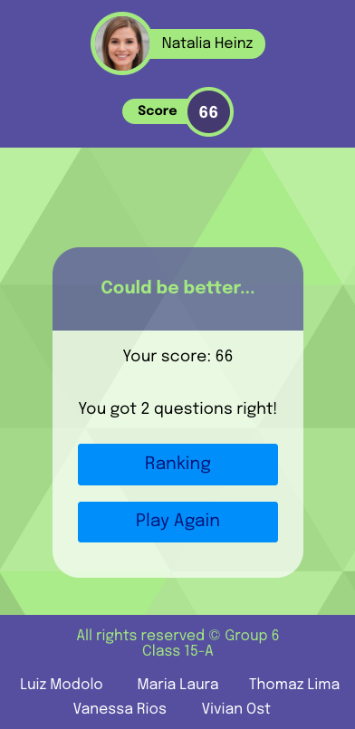 
Tela da de feedback.   

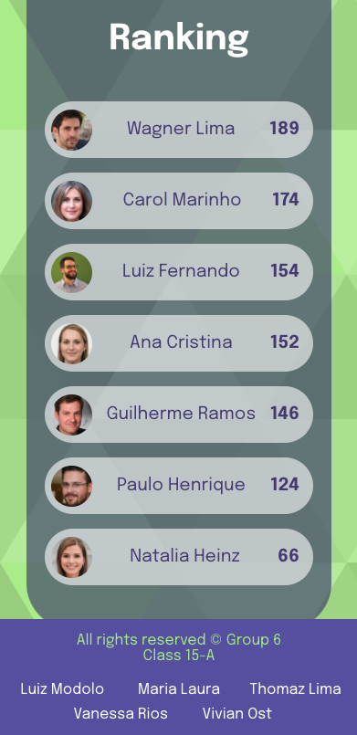 
Tela da de feedback ranking.    